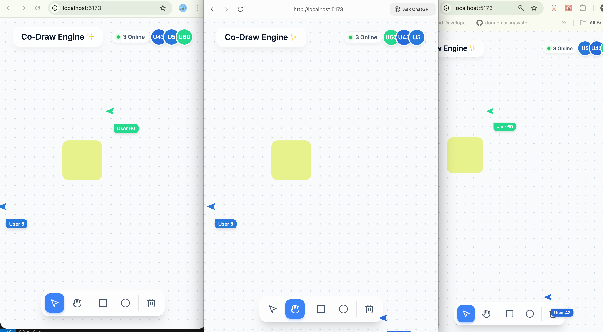

# Co-Draw Engine ✨



A real-time, high-concurrency multiplayer whiteboard built with React, Vite, and CRDTs. It was designed to provide a latency-free, Figma-like collaborative experience where multiple users can seamlessly pan, create shapes, drag elements, and track each other's pointers across an infinite canvas.

## Features

- **Infinite Scrolling Canvas:** Pan continuously across a dotted grid using the Hand tool or the middle mouse button.
- **Real-Time Collaboration:** Powered by Yjs, operations like moving shapes are resolved mathematically avoiding conflicts.
- **Live User Presence:** Join sessions seamlessly; see an avatar cluster displaying who is currently online, complete with random pastel HSL colors.
- **Ghost Cursors:** Watch what others are doing in real-time. Cursors are throttled via a 30ms network stream to keep the server blazing fast without choking your bandwidth.
- **Figma-like Camera Follow:** Click on an avatar in the header cluster to instantly lock your camera and follow their movements around the infinite canvas! 
- **Premium UI:** Glassmorphism UI, satisfying cubic-bezier transitions, scalable SVGs, drop-shadows during drag interactions, and Google Inter typography.

---

## How It Works Under The Hood

This project implements a **Centralized Relay / Decentralized State** architecture for immediate synchronisation.

### 1. The State Layer (Yjs CRDT)
Unlike traditional web-apps that synchronize state by sending JSON bodies (e.g. `PATCH /shapes/1`) and rely on a strict database schema via "Last-Write-Wins", this codebase relies on a **Conflict-Free Replicated Data Type** (CRDT) engine called [`Yjs`](https://yjs.dev/). 

- All board elements are tracked in a `Y.Array` containing individual `Y.Map` entries representing SVG elements.
- When two users drag the exact same shape simultaneously, Yjs treats these individual changes conceptually as a "tree" of operations, converging cleanly into the same view on all screens without overwriting unrelated properties. 
- Updates are transmitted via a highly compressed binary format (`Uint8Array`) making it far cheaper than JSON serialization.

### 2. The Transport Layer (Hocuspocus)
We use [`@hocuspocus/server`](https://tiptap.dev/hocuspocus) as our WebSocket relay layer binding Node.js to `Yjs`.
When a client connects to the web socket (e.g `ws://localhost:1234`), they subscribe to the `'staff-room-01'` document channel. Hocuspocus coordinates the broadcast of those tiny binary updates intelligently between your browser and other connected peers.

### 3. Awareness Protocol
Instead of treating ephemeral data (like mouse cursor X/Y hovering data, or your active username) as permanent records in the CRDT, we strictly map it to the Yjs **Awareness Protocol**. This spins up temporary channels across the WebSocket stream so that when you disconnect, your specific cursor instantly evaporates without leaving "tombstones" clogging up the Document tree memory.

---

## Setup & Running

You will need two terminals to run the frontend and the backend simultaneously.

### 1. Start the Sync Server (Backend)
Navigate to the `backend` folder and start the Hocuspocus Websocket relay:
```bash
cd backend
npm install
npm start
```
The server will run on `ws://localhost:1234`.

### 2. Start the React Client (Frontend)
Navigate to the `frontend` folder and start Vite:
```bash
cd frontend
npm install
npm run dev
```
Open **[http://localhost:5173/](http://localhost:5173/)** in multiple browser windows or tabs to see the multiplayer magic instantly synchronize.
